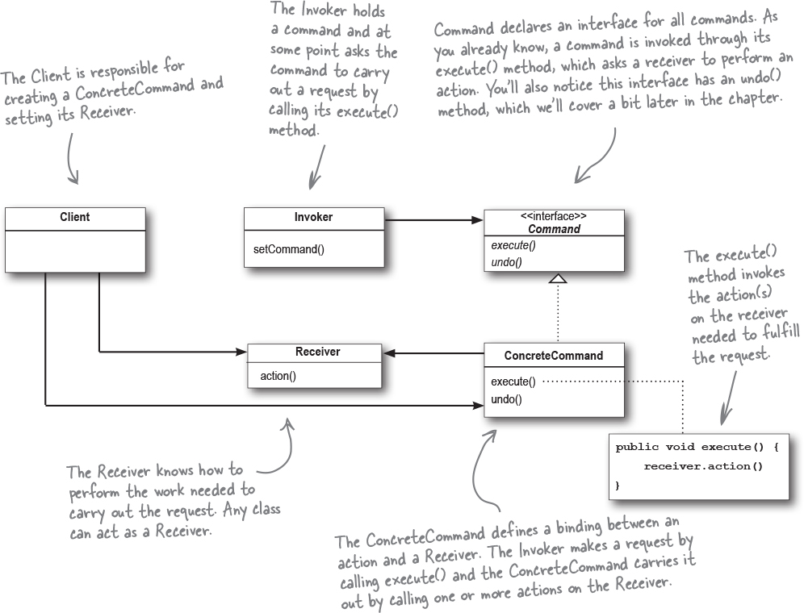

## Chapter 6. Encapsulating Invocation: The Command Pattern

This pattern is all about encapsulating method invocation. The Command Pattern turns a request into a stand-alone object containing all information about the request. This lets you pass requests as a method argument, delay or schedule the execution of a request, and support undoable operations.

#### Weather-O-Rama: Request to create API for Home Automation Remote Control

Weather-O-Rama likes our work and has hired us to build an API for their Home Automation Remote Control.
Here are some details about the remote:

- It has seven slots to program
- There are on and off butons for each of the seven slots
- There's a global undo button that undoes the operation of last button pressed

There is some functionality already built out from a vendor. Some of the interfaces include: `CeilingLight`, `ApplianceControl`, `Stereo`, `TV`, `FaucetCOntrol`, etc...

Some things to note from analyzing the existing vendor classes:

- Each class seems to have different methods (`on()`, `off()`, `dim()`, `setTemperature()`, etc,)
- We should figure out how to separate concerns - the remote should know how to interpret button presses and make requests, but it shouldn't need to know more given the variety of functionality for different home appliances
- We can do this by using the **Command Pattern** which allows you to decouple the requester of an action from the object that actually performs the action
- In this case, the requester would be the remote control and the object that performs the action would be an instance of one of our vendor classes
- For example, a command object encapsulates a request to do something (like turn on a light) on a specific object (say, the living room object). If we store a command object for each button, when the button is pressed we ask that command object to do some work. The remote doesn't have any idea what the work is, it just has a command objects that knows how to talk to the right object to get the work done.

#### Command Pattern Example: Ordering something at Objectville Diner

Let's say a customer wants to order something from the diner. We can destribe the interaction using command pattern!

1. Customer makes an order, so we call `createOrder()`, and this `Order` consists of an order slip and menu items that were choesn by the customer.
   a. Think of the order slip as the request to prepare a meal.
   b. The order slip implements an interface which consists of the `orderUp()` method.
   c. It also has a reference to the object that needs to prepare it (the short-order cook)
   d. The waiter doesn't need to know what's in the order or who prepares the meal, they only need to pass the slip through the order window and call `orderUp()`
2. The waiter takes the `Order`, so we call `takeOrder()`, and they call `orderUp()` to begin the Order's preparation
3. The `Order` directs the short-order cook with methods like `makeBurger()`, `makeShake()`
4. The short-order cook foolows the instructions of the `Order` and produces a meal

| Diner            | Command Pattern |
| ---------------- | --------------- |
| Waiter           | Command         |
| Short-order cook | execute()       |
| orderUp()        | Client          |
| Order            | Invoker         |
| Customer         | Reciever        |
| takeOrder()      | setCommand()    |

**Loading the Invoker**

1. The client creates a command object.
2. The client does a `setCommand()` to store the command object in the invoker.
3. Later, the client asks the invoker to execute the command.

### Designing the Remote API

First we need an interface for the commands.

```java
public interface Command {
  public void execute();
}
```

Now, we can implement this interface for different appliances.

```java
public class LightOnCommand implements COmmand {
  Light light;

  public LightOnCommand(Light light) {
    this.light = light;
  }

  public void execute() {
    light.on();
  }
}
```

To use the command object, we can program our remote control to store the command in a slot and execute when the button is pressed.

```java
public class SingleRemoteControl {
  // This slot holds our command, which will control one device
  Command slot;


  public SimpleRemoteControl() {}


  // We have a method for setting the command the slow is
  // going to control. This could be called multiple
  // times if the client of the code wanted to change the
  // behavior of the remote button.
  public void setCommand(Command command) {
    slot = command;
  }

  // This method is called when the button is presedd
  public void buttonWasPressed() {
    slot.execute;
  }
}

```

And finally some testing!

```java
public class RemoteControlTest {
  public static void main(String[] args) {
    SimpleRemoteControl remote = new SimpleRemoteCOntrol();
    Light light = new Light();
    LightOnCommand lightOn = new LightOnCommand(light);

    remote.setCOmmand(lightOn);
    remote.buttonWasPressed();
  }
}
```

#### ✏️ Practice - Implementing the `GarageDoorOpenCommand` class

```java
public interface GarageDoor() {
  up();
  down();
  stop();
  lightOn();
  lightOff();
}

```

```java
public class GarageDoorOpenedCommand implements Command {
  GarageDoor garageDoor;

  public GarageDoorDoorOpenedCommand(GarageDoor: garageDoor) {
    this.garageDoor = garageDoor;
  }

  public execute() {
    this.garageDoor.up();
  }
}
```

> 💡 The Command Pattern encapsulates a request as an object, thereby letting you parameterize other objects with different requests, queue or log requests, and support undoable operations.

So far, we've seen examples of how a command object encapsulates a request by binding together a set of actions on a specific reciever. This is done by packaging the actions and the reciever into an object that exposes just on emethod `execute` (for example: Garage Door is the receiever, and the action is up).

We've also seen examples of parameterizing an object with a command. We first called our remote control with the "light on" command and then replaced it with "garage door open".

Next, we will learn how to implement queues and logs and support undo operations! We will also learn about the Meta Command Pattern, which allows you to create macros of commands so that you can execute multiple commands at once.

### The Command Pattern Defined



1. The **Invoker** is responsible for initiating requests. This class must have a field for storing a reference to a command object. The invoker triggers that command instead of sending the request directly the reciever.
2. The **Command** interface usually declares just a single method for executing the command.
3. **Concrete Commands** implement various kinds fo requests. A concrete command isn't supposed to perform the work on its own, but rather to pass the call to one of the business logic objects.
4. The **Receiver** class contains some business logic. Most commands only handle the details of how a request is passed to the receiver, while the receiver itself does the actual work.
5. The **CLient** creats and configures concrete command objects. The client must pass all the request parameters, including a reciever instance, into the commands constructor. After that, the resulting command may be associated with one or multiple senders.

### Assigning Commands to slots

If you recal,, we have seven slots on our remote. We're going to assign a command to each slot in the remote control.

- Our remote control is the _invoker_
- When a button is pressed, the execute() method will be called on the corresponding command, which results in actions being invoked on the _receiver_ (lights, ceiling fans, stereos,e tc)

```java
public class RemoteCOntrol {
  Command[] onCommands;
  Command[] offCommands;

  public RemoteControl() {
    onCommands = new Command[7];
    offCommands = new Command[7];

    Command noCommand = new NoCommand();
    for(int i = 0; i < 7; i++) {
      onCommands[i] = noCommand;
      offCOmmands[i] = noCommand;
    }
  }

  public void setCommand(int slot, Command onCOmmand, Command offCommand) {
    onCommands[slot] = onCommand;
    offCommands[slot] = offCommand;
  }

  public void onButtonWasPushed(int slot) {
    onCommands[slot].execute();
  }

  public void offButtonWasPushed(int slot) {
    offCommands[slot].execute();
  }

  public String toString() {
    StringBuffer stringBuff = new StringBuffer();

    stringBuff.append("\n -------- Remote Control --------\n");
    for(int i = 0; i < onCommands.length; i++) {
      stringBuff.append("[slot " + i + "]" + onCommands[i].getClass().getName() + "    " + offCommands[i].getClass().getName() + "\n");
    }
  }

}

```

We also need to add on and off functionality for our devices.

```java
public class StereoOnWithCDCommand implements Command {
  Stereo stereo;

  public StereoOnWithCdCommand(Stereo stereo) {
    this.stereo = stereo;
  }

  public void execute() {
    stereo.on();
    stereo.setCD();
    stereo.setVolume(11);
  }
}


```

**📝 Noteworthy: Using a Null Object**
In our implementation, we used a `NoCommand` object to set up our remote control buttons. This is an example of a null object, which is useful when you don't have a meaningful object to return, but you don't want to remove the responsibility for handling null from the client.

### Supporting Undo functionality

When commands support undo, they have an `undo()` method that mirrors the `execute()` method. Whatever `execute()` last did, `undo()` reverses.

So, in order to support this functionality, we need to udpate our Command Interface to include this method.

```java
public interface Command {
  public void execute();
  public void undo();
}
```

Now we implement it for each command (it will of course look different for each).

```java
public class LightOnCommand implements Command {
  Light light;

  public LightOnCommand(Light light) {
    this.light = light;
  }

  public void execute() {
    light.on();
  }

  public void undo() {
    light.off();
  }
}

```

```java
public class LightOffCommand implements Command {

  public LightOnCommand(Light light) {
    this.light = light;
  }

  public void execute() {
    light.on();
  }

  public void undo() {
    light.on();
  }
}

```

Now, to get our Remote Control class to support it, we need a new instance variable to track the last command invoked. Whenever undo is pressed, we retrieve that command and invoke its `undo()` method.

```java
public class RemoteControlWithUndo {
  Command[] onCommands;
  Command[] offCommands;

  // new instance var alert!!
  Command undoCommand;

  public RemoteControl() {
    onCommands = new Command[7];
    offCommands = new Command[7];

    Command noCommand = new NoCommand();
    for(int i = 0; i < 7; i++) {
      onCommands[i] = noCommand;
      offCOmmands[i] = noCommand;
    }

    undoCommand = noCommand;
  }

  public void setCommand(int slot, Command onCOmmand, Command offCommand) {
    onCommands[slot] = onCommand;
    offCommands[slot] = offCommand;
  }

  public void onButtonWasPushed(int slot) {
    onCommands[slot].execute();
    undoCommand = onCommands[slot];
  }

  public void offButtonWasPushed(int slot) {
    offCommands[slot].execute();
    undoCommand = offCommands[slot];
  }

  public void undoButtonWasPushed() {
    undoCommand.undo();
  }

  public String toString() {
    StringBuffer stringBuff = new StringBuffer();

    stringBuff.append("\n -------- Remote Control --------\n");
    for(int i = 0; i < onCommands.length; i++) {
      stringBuff.append("[slot " + i + "]" + onCommands[i].getClass().getName() + "    " + offCommands[i].getClass().getName() + "\n");
    }
  }

}

```

### Summary

Command Pattern: encapsulates a request as on object, there by letting you parameterize clients with different requests, queue or log requests, and support undoable operations.

- The Command Pattern decouples an object making a request from the one that knows how to perform it.
- A Command object is at the center of this decoupling and ecnapsulates a receiver with an action (or set of actions).
- An invoker makes a request of a Command object by calling its `execute()` method, which invokes those actions on the receiver.
- Invokers can be parameterized with Commands, even dynamically at runtime.
- Commands may support undo by implementing an `undo()` method that restores the object to its previous state before the `execute()` method was last called.
- MacroCommands are a simple extension of the Command Pattern that allow multiple commands to be invoked. Likewise, MacroCommands can easily support `undo()`.
- In practice, it's not uncommon for "smart" Command objects to implement the request themselves rather than delegating to a reciever.
- Commands may also be used to implement logging and transactional systems.
