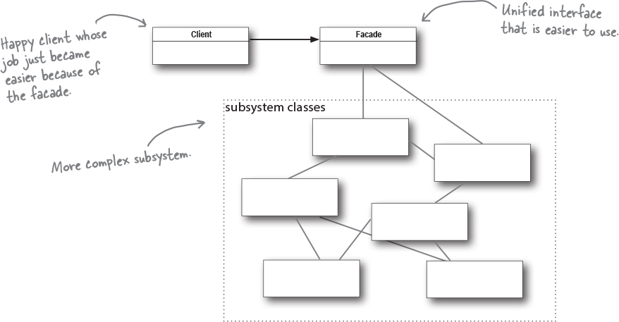

## Chapter 7. Being Adaptive: The Adapter and Facade Patterns.

This chapter helps us understand how to wrap objects to make their interfaces look like something they're not. We do this so we can adapt a design expecting one interface to a class that implements a different interface. We're also going to learn how to wrap objects to simplify their interfaces.

### Adapters alll around us

Adapters appear everywhere in our daily lives. For example, if you've ever traveled to another country, it is not uncommon that you've had to use an AC power adapter so that your laptop plug fits into another outlet. The job of the adapter is to change the interface of the outlet into on that your laptop plug expects.

#### Object-oriented adapters

Adapters become useful in software when you need to make two different interfaces work together. This can happen you have some existing software system that you need to work a new vendor class library into, but the new vendor designed their interfaces differently than the last vendor.

Instead of writing your existing code different (since you can't change the vendors code), you can write a class that adapts the new vendor interface into the one you're expecting.

The **adapter** acts as a middleman by recieving requests from the client and converting them into requests that make sense on the vendor classes.

### The Adapter Pattern Explained

1. The client makes a request to the adapter by calling a method on it using the target interface.
2. The adapter translates the request into one or more calls on the adaptee using the adaptee interface.
3. The client receives the results of the call and never knows there is an adapter doing the translation.

Example with adapting the Turkey to the Duck class with a `TurkeyAdapter`:

Recall our Duck interface?

```java
public interface Duck {
  public void quack();
  public void fly();
}
```

Well, we also have a Turkey interface.

```java
public interface Turkey {
  public void gobble();
  public void fly();
}
```

We are short on Duck objects and want to use some Turkey objects in their place. We can't use Turkeys outright because they have a different interface, so we need to write an adapter.

```java

// First, we implement the interface of the type we're adapting to.
// This is the interface your cilent expects to see.
public class TurkeyAdapter implements Duck {
  Turkey turkey;


  // Next, we get a reference to the object that we are adapting,
  // here we do that through the constructor.
  public TurkeyAdapater(Turkey turkey) {
    this.turkey = this;
  }

  public void quack() {
    // We now need to implement all the methods in the interface
    turkey.gobble();
  }

  // Even though both interfaces have a fly() method,
  // turkeys fly in short spurts - they can't do long-distance
  // flying like ducks. To map between a Duck's fly() method and Turkey's,
  // we need to call Turkey's fly() method five times to make up for it.
  public void fly() {
    for(int i = 0; i < 5; i++) {
      turkey.fly();
    }
  }
}

```

Now to test drive the adapter...

```java
public class DuckTestDrive {
  public static void main(String[] args) {
    Duck duck = new MallardDuck();
    Turkey turkey = new WildTurkey();

    Duck turkeyAdapter = new TurkeyAdapater(turkey);

    System.out.println("The turkey says...");
    turkey.gobble();
    turkey.fly();

    System.out.pintln("\nThe Duck says...");
    testDuck(duck);

    System.out.pintln("\nThe TurkeyAdapter says...");
    testDuck(turkeyAdapter);
  }

  static void testDuck(Duck duck) {
    duck.quack();
    duck.fly();
  }
}

```

**No dumb questions!!**
Q: If your target interface is really large, how much of it should you "adapt"?
A: Implementing an adapter is proprotional to the size of the interface you need to support as your target audience. But, even if the implementation is large, reworkinga ll your client-side calls is also a big effort and with applying the adapater pattern you at least have a class that encapsulates all the changes.

Q: Does an adapter always wrap one and only one class?
A: No, you may have situations where your adapter holds two or more adaptees that are needed to implement the target interface. This relates to the Facade pattern, which we will learn about next!

Q: What if you have old and new parts of a system, and the old parts expect the old vendor interface, but you've already written new parts to use the new vendor interface? Should you still use an adapter?
A: You can create a two way adapter that supports both interfaces. To create one, you just implement both interfaces involved, so the adapter can act as an old interface or a new interface.

> 💡 The Adapter Pattern converts the interface of a class into another interface the client expects. Adapater lets classes work together that couldn't otherwise because of incompatible interfaces.


Object-oriented design principles demonstrated by the Adapter Pattern:

- Object composition is used to wrap the adaptee with an altered interface.
- The pattern binds the client to an interface, not an implementation.

### Object and Class Adapaters

The difference between object and class adapter, is that to implement a class adapter, you subclass the Target and the Adaptee, while with an object adapter, we use composition to pass requests to an Adaptee.


### The Facade Pattern

The Facade Pattern takes a complex subsystem and makes it easier by implementing a Facade Class that provides a more reasonable interface.

Let's say there'a complex system describing watching a movie at home. There are a lot of steps involved in this process:

1. Turn on the popocorn popper.
2. Star the poppper popping.
3. Dim the lights.
4. Put the screen down.
5. Turn the projector on.
6. Set the projector input to streaming player.
7. Put the projector on wide-screen mode.
8. Turn the sound amplifier on.
9. Set the amplifier to streaming player input.
10. Set the amplifier to surround sound.
11. Set the amplifier volume to medium.
12. Turn the streaming player on.
13. Start playing the movie.

Instead of doing all of this, we can create a Facade class for the home theater system. This class will expose simple methods such as `watchMovie()`.

| HomeTheaterFacade |
| ----------------- |
| watchMovie();     |
| endMove();        |
| listenToRadio();  |
| endRadio();       |

The Facade class treats the home theater components as a subsystem and calls on the subsystem to implements its `watchMovie()` method.

Now, the client code calls methods on the home theater Facade, not on the subsystem. So now to watch a movie, we just call one method `watchMovie()` and it communicates with the lights, streaming player, projector, amplifier, screen, and popocorn maker for us.

**No dumb questions!!**
Q: If the facade encapsulates the subsystem classes, how does a client that needs lower-level functionality gain access to them?
A: Facades don't "encapsulate" the subsystem classes, they just provide a simplified interface to their functionality. The subsystem classes remain available for direct use by the clients that need them.

Q: Does the facade add any functionality or does it just pass through each request to the subsystem?
A: A facade is free to add its own "smarts" in addition to making use of the subsystem. For example, while our home theater facade doesn't implement any new behavior, it is smart enough to know that the popcorn popper has to be turned on before it can pop.

Q: Does each subsystem only have one facade?
A: Not necessarily. The pattern allows any number of facades to be created for a given subsystem.

Q: What's the benefit of this pattern other than having a simpler interface?
A: It allows you to decouple your client implementation from any one subsystem. For example, let's say you upgrade your home theater system with new components that have different interfaces. Your client code doesn't need to change, just the facade.

> 📝 A facade not only simplifies an interface, it decouples a client from a subsystem of components. Facades and adapters may wrap multiple classes, but a facade's intent is to simplify, while an adapter's is to convert the interface to something different.

### Facade Pattern Defined

> 💡 The Facade Pattern provides a unified interface to a set of interfaces in a subsystem. Facade defines a higher-level interface that makes the subsystem easier to use.



## The Principle of Least Knowledge

This principle guides us to reduce the interactions between objects to just a few close "friends". THe principle is ususally stated as:

> ☯️ Design Principle: Principle of Least Knowledge: talk only t your immediate friends.

What this means is that when you're designing a system, for any object, be careful of the number of classes it interacts with and also how it comes to interact with those classes. This principle prevents us from creating designs that have a large number of classes coupled together, so that changes in one part of the system cascade to other parts.

To do this, take any object, and from any method in that object, invoke only methods that belong to:

- The object itself
- Objects passed in as a parameter to the method
- Any object the method creates or instantiates
- Any components of the object (any object that is referenced by an instance variable, aka "has-a" relationship)

This principle is also known as _The Law of Demeter_.

### Summary

- When you need to use an existing class and its interface is not hte one you need, use an adapter.
- When you need to simplify and unify a large interface or complex set of interfaces, use a facade.
- An adapter changes an interface into one a client expects.
- A facade decouples a client from a complex subsystem.
- Implementing an adapter may require little work or a great deal fo work depending on the size and complexity of the target audience.
- Implementing a facade requires that we compose the facade with its subsystem and use delegationto perform the work of the facade.
- There are two forms of the Adapter pattern: object and class adapaters. Class adapaters require multiple inheritance.
- You can implement more than one facade fora subsystem.
- An adapter wraps an object to change its interface, a decorator wraps an object to add new behaviors and responsibilities., and a facade "wraps" a set of objects to simplifer it.
