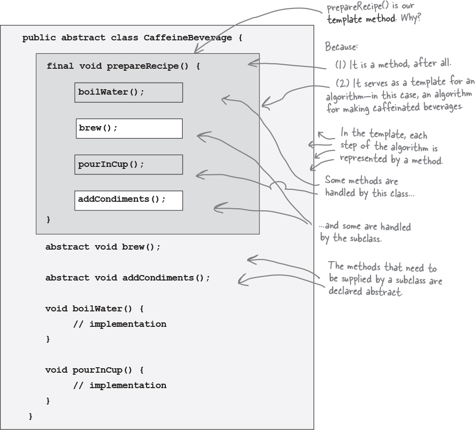
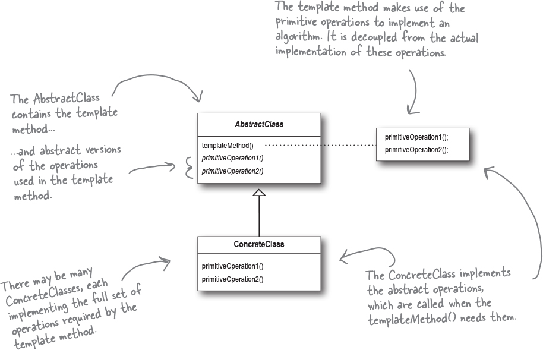

## Chapter 8. Encapsulating Algorithms: The Template Method Pattern

Code duplication is a good sign we need to clean up the design by abstracting the commonality into a base class.

**Example: classes to represent making coffee and tea**
The recipe to make coffee is pretty similar for the recipe to make tea.

Coffee:

1. Boil some water
2. Brew coffee in boiling water
3. Pour coffee in cup
4. Add sugar and milk

Tea:

1. Boil some water
2. Steep tea in boiling water
3. Pour tea in cup
4. Add lemon

To abstract the commonality, we'll first note the parts of the algorithm that are the same.

```js
1. Boil some water. // This is already abstracted
2. Use the hot water to extract the coffee or tea. // Not abstracted, but same process applied to different beverages
3. Pour the resulting beverage into a cup // Abstracted
4. Add the appropriate condiments to the beverage // Not abstracted, but same process again
```

#### Abstracting `prepareRecipe()`

```java
public abstract class CaffeineBeverage {
    /*
    * This is declared as final because we don't want our subclasses
    * to be able to override this method and change the recipe
    **/
    final void prepareRecipe() {
        boilWater();
        brew(); // This was a repacement for brewCoffeeGrinds() and steepTeaBag()
        pourInCup();
        addCondiments(); // This was a replacement for addSugarAndMilk() and addLemon()
    }

    /**
     * Coffee and tea handle these methods in deifferent ways,
     * so we declare them as abstract so the subclasses can
     * implement them.
     **/
    abstract void brew();

    /**
     * Same applies here!
     **/
    abstract void addCondiments();

    void boilWwater() {
        System.out.println("Boiling water!");
    }

    void pourInCup() {
        System.out.println("Pouring into cup!");
    }
}

```

Now, we create the coffee and tea classes which rely on `CaffeineBeverage` to handle the recipe.

```java
public class Tea extends CaffeineBeverage {
    public void brew() {
        System.out.println("Steeping the tea!");
    }

    public void addCondiments() {
        System.out.println("Adding Lemon!");
    }
}
```

```java
public class Coffee extends CaffeineBeverage {
    public void brew() {
        System.out.println("Dripping Coffee through filter!");
    }

    public void addCondiments() {
        System.out.println("Adding sugar with oat milk!");
    }
}
```

With the above implementation, we've recognized that the two recipes are essentially the same, although some o the steps require different implementations.

We've generalized the recipe and placed the commonality in the base class.

### Meet the Template Method

In our example, the `prepareRecipe()` is our **template method**.

> The Template Method defines the steps of an algorithm and allows subclasses to provide the implementation for one or more steps.



Stepping through the process to make tea, we can see how the template method works.

1. First we make a tea object

```java
Tea myTea = new Tea();
```

2. Then we call the template method:

```java
myTea.prepareRecipe();
```

3. First we boil water.

```java
boilWater(); // This happens in CaffeineBeverage
```

4. Next we brew the tea, which only the subclass knows how to do:

```java
brew(); // This happens in Tea
```

5. Now we pour the tea in the cup

```java
pourInCup(); // This happens in Caffeine Beverage
```

6. Finally, we add condiments, which are specific to each beverage, so the subclass implements this.

```java
addCondiments();
```

### Comparing the implementations

| Tea and Coffee                                                                                   | CaffeineBeverage (with template method)                                                                                                                                |
| ------------------------------------------------------------------------------------------------ | ---------------------------------------------------------------------------------------------------------------------------------------------------------------------- |
| Coffee and Tea control the algorithm                                                             | CaffeineBeverage controls the algorithm and protects it                                                                                                                |
| Code is duplicated across both classes                                                           | Maximizes reuse among the subclasses                                                                                                                                   |
| Code changes to the algorithm require opening the subclasses and making multiple changes         | Algorithm lives in only one place and code changes only need to be made there.                                                                                         |
| Classes are organized in a structure that requires a lot of work to add a new caffeine beverage. | The Template Method pattern provides a framework that other caffeine beverages can be plugged into. New caffeine beverages only need to implement a couple of methods. |
| Knowledge of the algorithm and how ti implement it is distributed across many classes.           | The knowledge about the algorithm is concentrated to provide complete implementations.                                                                                 |

## Template Method

**The Template Method Pattern** defines the skeleton of an algorithm in a method, deffering some steps to subclasses. Template Method lets subclasses redefine certain steps of an algorithm without changing the algorithm's structure.

**📝 Implementation Notes**:

- The abstract class contains the template method and abstract versions of the operations used in the template method.
- The template method makes use of the primitive operations to implement an algorithm. It is decoupled from thea ctual implementation of these operations.
- There may be many concrete classes, each implementing the full set of operations required by the tempalte method.
- The concrete class implements the abstract oeprations, which are claled when the template method needs them.



```java

// Declared abstract because it's meant to be subclassesd by classes that provide
// implementations of the operations.
abstract class AbstractClass {

    // Declared as final to prevent subclasses rom reworking the sequence of steps
    // in the algorithm.
    final void templateMethod() {
        primitiveOperation1();
        primitiveOperation2();
        concreteOperation();
        hook();
    }

    // Primitive Operation must be implemented by subclass
    abstract void primitiveOperation1();

    // Primitive Operation must be implemented by subclass
    abstract void primitiveOperation2();

    void concreteOperation() {
        // implementation here - defined by the abstract class
        // can be overriden by subclasses, or we can prevent that by declaring it
        // as final.
    }

    // Hooks are declared in the abstract class and are given an empty
    // or default implementation.
    // This gives the subclasses the ability to "hook into" the algorithm at various
    // points, if they wish.
    void hook() {
      // A concrete method that does nothing!
      // These are called "hooks". Subclasses are free to override these,
      // but they don't have to.
    }
}
```

#### Example of using hooks in abstract classes

```java
public abstract class CaffeineBeverageWithHook {
    final void prepareRecipe() {
        boilWater();
        brew();
        pourInCup();

        if (customWantsCondiments() {
          addCondiments();
        })
    }

    abstract void brew();

    abstract void addCondiments();

    void boilWater() {
        System.out.println("Boiling water!");
    }

    void pourInCup() {
        System.out.println("Pouring into cup!");
    }

    // This is a hook because the subclasses can override this method,
    // but they don't have to!
    boolean customerWantsCondiments() {
        return true;
    }
}

```

To use the hook, we override it in our subclass.

```java
public class CoffeeWithHook extends CaffeineBeverageWithHook {
    public void brew() {
        System.out.println("Dripping coffee through the filter!");
    }

    public void addCondiments() {
        System.out.println("Adding oat milk!!!");
    }

    public boolean customerWantsCondiments() {
        String answer = getUserInput();
        if (answer.toLowerCase().startsWith("y")) {
          return true;
        } else {
          return false;
        }
    }

    private String getUserInput() {
        String answer = null;

        System.out.println("Would you like milk and sugar with your coffee? Answer y/n.");

        BufferedReader in = new BufferedReader(new InputStreamReader(System.in));

        try {
            answer = in.readLine();
        } catch (IOException ioe) {
            System.err.println("IO Error trying to read  your answer");
        }

        if (answer == null) {
            return "n";
        }

        return answer;
    }
}


```

### Questions and Answers time!!

**Question: How do I know when to use abstract methods vs hooks when creating a template method?**

- Use abstract methods when your subclass _must_ provide an implementation of the method or step in the algorithm.
- Use hooks when that part of the algorithm is optional.

**Question: What are hooks really supposed to be used for?**

- A hook may provide a way for a subclass to implement an optional part of an algorithm
- It can give the subclass a chance to react to some step in the template method that is about to happen, or that just happened (e.g. a hook method like `justReorderedList()` allows the subclass to preform some activity)
- A hook can also provide a subclass with the ability to make a decision for the abstract class.

**Question: Does a subclass have to implement all abstract methods in the AbstractClass?**
Yes

> ☯️ The Hollywood Principle. Don't call us, we'll call you.

The **Hollywood Principle** gives us a way to prevent _dependency rot_.

- Dependency rot happens when you have high-level components depending on low-level components, dependneing on high-level components, etc etc etc
- When rot happens, no one can easily understand the way a system is designed.
- With the Hollywood Principle, we allow low-level components to hook themselves into a system, but the high-level components determine when they are needed, and how.
- High-level components give the low-level components the "don't call us, we'll call you" treamtent.


- The Hollywood Principle and the Template Method Pattern are connected because when we design the Template Method Pattern, we're telling subclasses, "don't call us, we'll call you."


✏️ Recap Example, match the pattern with it's description!
Template Method: Subclasses decide how to implement steps in an algorithm.
Strategy: Encapsulate interchangeable behaviors, and use delegation to decide which behavior to use.
Factory Method: Subclasses decide which concrete classes to create.

### Summary

Our newest OO Principle: Don't call us, we'll call you. 😎

- This principle reminds you that your superclasses are running the show, so let them call your subclass methods when they're needed (just like they do in Hollywood).

**Template Method**: Define the skeleton of an algorithm in an operation, deferring some steps to subclasses. Template method lets subclasses redefine certain steps of an algorithm without changing the algorithm's structure.

- A template method defines the steps of an algorithm, deferring to subclasses for the implementation of those steps.
- The Template Method Pattern gives us an important technique for code reuse.
- The template method's abstract class may define concrete methods, abstract methods, and hooks.
- Abstract methods are implemented by subclasses.
- Hooks are methods that do nothing, or default to some behvaior, in the abstract class. They may be overriden by the subclass.
- To prevent subclasses from changing the algorithm in the template method, declare the template method as final.
- The Hollywood Principle guides us to put decision making in high-level modules that can decide how and when to call low-level modules.
- You'll see lots of uses of the Template Method Pattern in real-world code, but (as with any pattern), don't expect it all to be designed "by the book"
- The Strategy and Template Method Patterns both encapsulate algorithms, the first by composition, the second by inheritance.
- Factory Method is a specialization of the Template Method.
