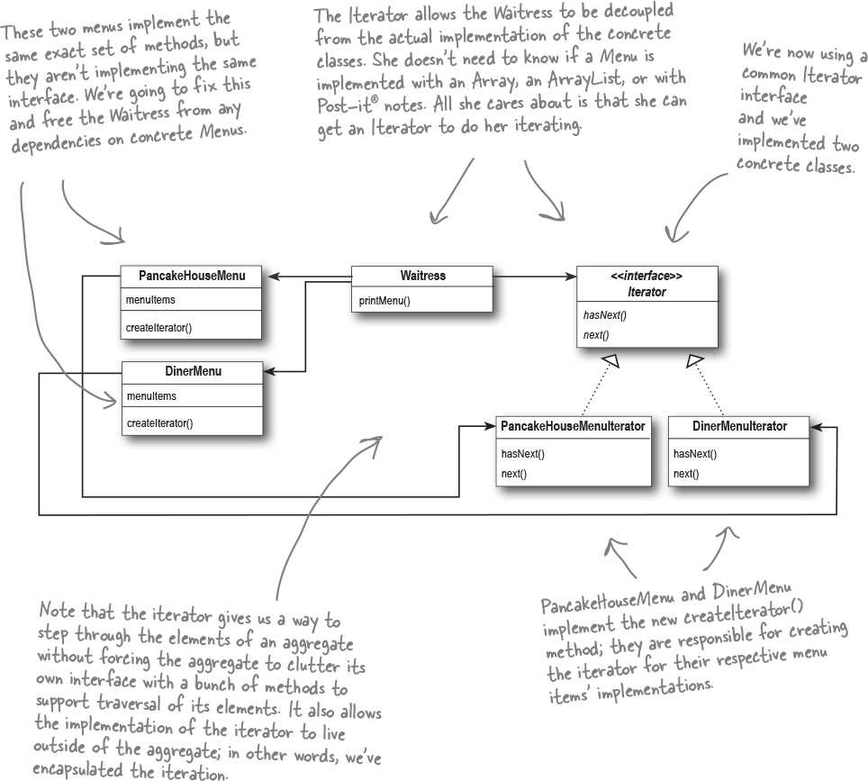
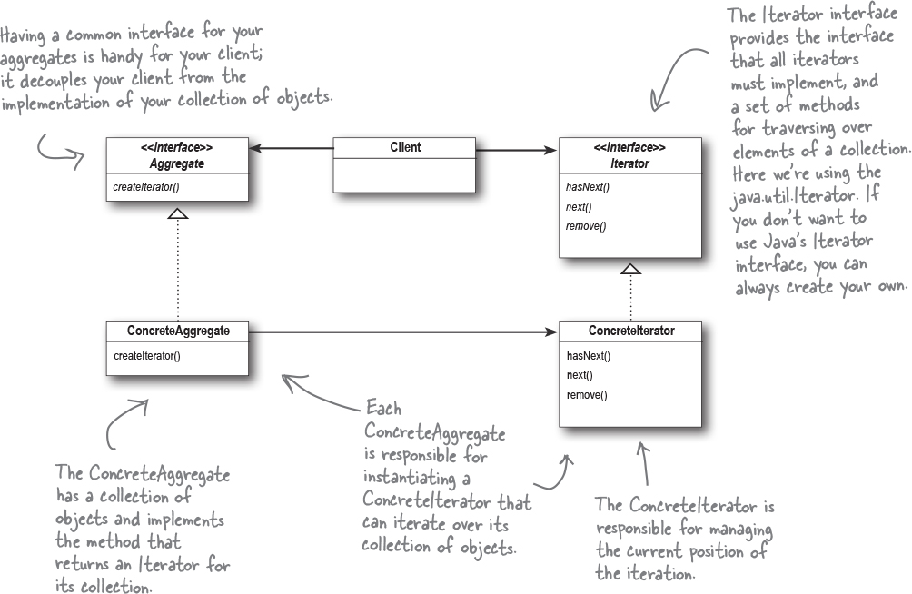
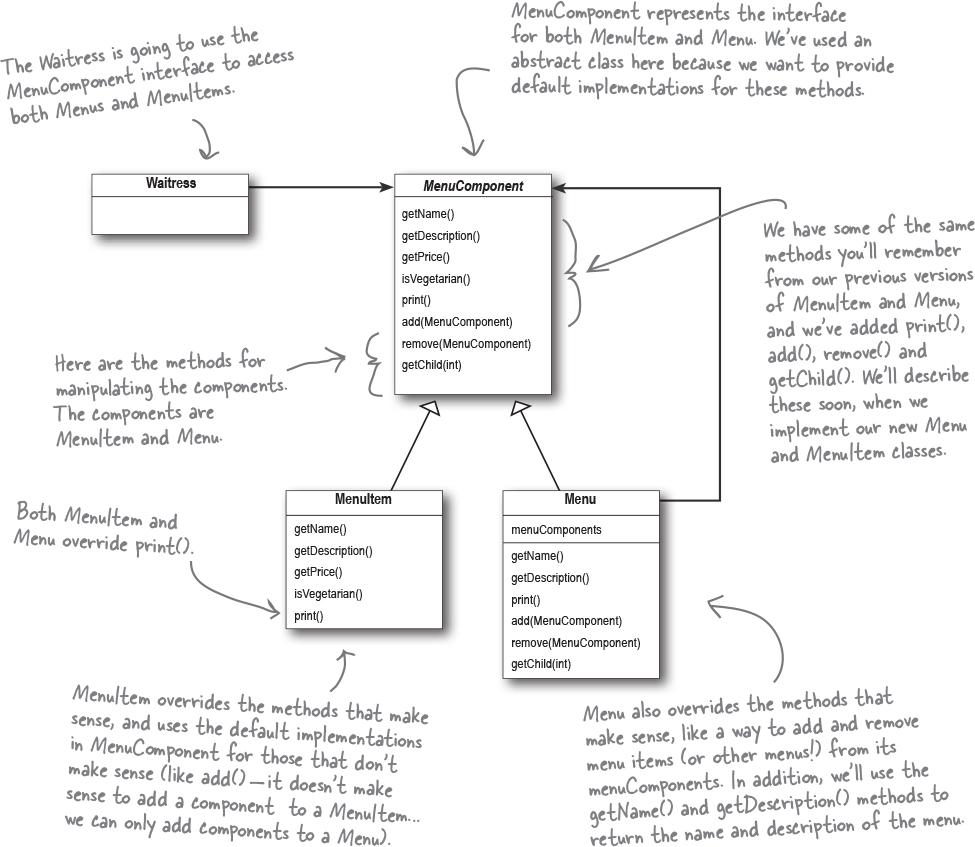
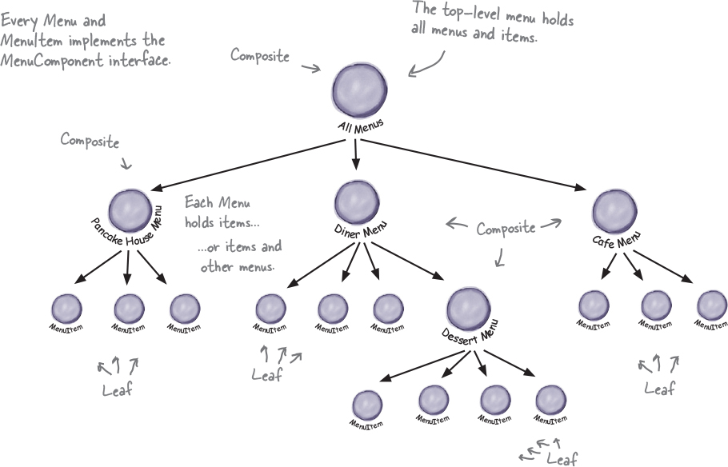

## Chapter 9. Well-Managed Collections: The Iterator and Composite Patterns

This chapter defines patterns that help with enacapsulation of collections.

Scenario: Objectville Diner and Objectville Pancake House merge.

- Pancake House has their menu in an ArrayList
- Objectville Diner has their menu in an Array
- Neither of them is willing to change their implementations, because they have too much code that depends on them.

The Java-enabled Waittress Specification:

```markdown
`printMenu()`: prints every item on the breakfast and lunch menus

`printBreakfastMenu()`: prints just breakfast items

`printLunchMenu()`: prints just lunch items

`printVegetarianMenu()`: prints all vegetarian menu items

`isItemVegetarian(name)`: given the name of an item, returns true if the item is vegetarian, otherwise, returns false
```

The first attempt to print all the items on each menu looks like this:

```java
PancakeHouseMenu phMenu = new PancakeHouseMenu();
ArrayList<MenuItem> breakfastItems = phMenu.getMenuItems();

DinerMenu dMenu = new DinerMenu();
MenuItem[] lunchItems = dMenu.getMenuItems();

for (int i = 0; i < breakfastItems.size(); i++) {
    MenuItem menuItem = breakfastItems.get(i);
    System.out.println(menuItem.getName() + " " + menuItem.getPrice() + " " + menuItem.getDescription())
}

for (int i = 0; i < lunchItems.length; i++) {
    MenuItem menuItem = lunchItems[i];
    System.out.println(menuItem.getName() + " " + menuItem.getPrice() + " " + menuItem.getDescription())
}

```

Based on the following implementation, the following apply:

- We are coding to the `PancakeHouseMenu` and `DinerMenu` concrete implementations, not to an interface.
- If we decided to switch from using `DinerMenu` to another type of menu that implemented its list of menu items with a hash table, we'd have to modify a lot of code in the Waitress.
- We have duplicate code: the `printMenu()` methods needs two separate loops to iterate over the two different kinds of menus. And if we needed a third menu, we'd have yet another loop.

What if we created an iterator htat encapsulates the way we iterate through a collection of object's?

```java

Iterator iterator = breakfastMenu.createIterator();
while (iterator.hasNext()) {
    MenuItem menuItem = iterator.next();
}

Iterator iterator = lunchMenu.createIterator();
while (iterator.hasNext()) {
  MenuItem menuItem = iterator.next();
}
```

### Meet the Iterator Pattern

The iterator pattern relies on an interface called an Iterator. Here's one possible interface:
| Iterator |
|----------|
| hasNext() - tells us if there are more elements to iterate through|
| next() - returns the next object in the aggregate |

Note: A **Collection** is just a group of objects. They might be stored in different data structures, like lists, arrays, or hash maps, but they're all still collections. They're also sometimes called **Aggregates**.

#### Adding an Iterator to DinerMenu

First, we need to define the iterator interface.

```java
public interface Iterator {
    boolean hasNext();
    MenuItem next();
}
```

Now, we implement a concrete iterator that works for the DIner menu:

```java
public class DinerMenuIterator implements Iterator {
    MenuItem[] items;
    int position = 0;

    public DinerMenuIterator(MenuItem[] items) {
        this.items = items;
    }

    public MenuItem next() {
        MenuItem menuItem = items[position];
        position += 1;
        return menuItem;
    }

    public boolean hasNext() {
        // This checks to see if we've seen all the elements in the array
        // We also need to check if the value is null, since this is a fixed-size array
        if (position >= items.length || items[position] == null) {
            return false;
        } else {
            return true;
        }
    }
}
```

To rework the DinerMenu with Iterator, we need to add one method to create a `DinerMenuiterator` and return it to the client:

```java
public class DinerMenu {
    static final int MAX_ITEMS = 6;
    int numberOfItems = 0;
    MenuItem[] menuItems;

    // constructor here

    // add item here

    public Iterator createIterator() {
        return new DinerMenuIterator(menuItems);
    }

    // other menu methods here
}

```

#### Fixing up the Waitress code

```java
public class Waittress {
    PancakeHouseMenu phMenu;
    DinerMenu dMenu;

    pubilc Waittress(PancakeHouseMenu phMenu, DinerMenu dMenu) {
        this.phMenu = phMenu;
        this.dMenu = dMenu;
    }

    public void printMenu() {
        Iterator pancakeIterator = phMenu.createIterator();
        Iterator dinerIterator = dMenu.createIterator():

        System.out.println("MENU\n-----\nBREAKFAST");
        printMenu(pancakeItrator);

        System.out.println("MENU\n-----\nLUNCH");
        printMenu(dinerIterator);
    }

    private void printMenu(Iterator iterator) {
        while (iterator.hasNext()) {
            MenuItem menuItem = iterator.next();
            System.out.println(menuItem.getName() + " " + menuItem.getPrice() + " " + menuItem.getDescription())
        }
    }
}
```

### Comparing the Implementations

| Hard-to-maintain Waittress Implementation                                                                    | New, Hip Waittress Powered by Iterator                                                                                                                      |
| ------------------------------------------------------------------------------------------------------------ | ----------------------------------------------------------------------------------------------------------------------------------------------------------- |
| Menus are not well encapsulated. Can see Diner is using an ArrayList, while Pancake House is using an Array. | Menu implementaitons are encapsulated. The Waittress has no idea how the Menus hold their collections of menu items.                                        |
| Need to loop twice to iterate through menu items.                                                            | All we need is a loop that polymorphically handles any collection of items, as long as it implements Iterator.                                              |
| Waittress is bound to concrete classes (MenuItem[] and ArrayList)                                            | Waittress now uses an interface (iterator)                                                                                                                  |
| Waittress is bound to two different concrete Menu classes, despite their interfaces being almost identical.  | Menu interfaces are now exactly the same but we still don't have a common interface, which means the Waittress is still bound to two concrete Menu classes. |



#### Making Improvements

So, PancakeHouseMenu and DinerMenu are exactly the same, yet they don't have a common interface defined for them yet. So let's change that!

Java has an Iterator inteface, we can switch our interfaces to use this instead.

| Inteface                                                                                                            |
| ------------------------------------------------------------------------------------------------------------------- |
| hasNext()                                                                                                           |
| next()                                                                                                              |
| remove() - optional method that allows us to remove the last item returned by the next() method from the aggregate. |

Cleaning things up for PancakeHouse is easy because ArrayList has an `iterator()` method that returns an iterator.

```java
public Iterator<MenuItem> createIterator() {
    return menuItems.iterator();
}

```

It's a little more work for DinerMenu because it relies on Array.

```java
import java.util.Iterator;

public class DinerMenuIterator implements Iterator<MenuItem> {
    MenuItem[] items;
    int position = 0;

    public DinerMenuIterator(MenuItem[] items) {
        this.items = items;
    }

    public MenuItem next() {
        // implementation here
    }

    public boolean hasNext() {
        // implementaiton here
    }

    public void remove() {
        throw new UnsupportedOperationException("You shouldn't be trying to remove menu items.");
    }
}

```

Now, we need to give the Menus a common interface and rework the Waittress a little.

```java
public interface Menu {
    public Iterator<MenuItem> createIterator();
}

```

We re-work our Waittress class to use Java Iterator and replace the concrete Menu classes with the Menu interface. This solves the problem of the Waittress dependning on the concrete Menus.

```java

import java.util.Iterator;

public class Waittress {
    Menu pancakeHouseMenu;
    Menu dinerMenu;

    public Waittress(Menu pancakeHouseMenu, Menu dinerMenu) {
        this.pancakeHouseMenu = pancakeHouseMenu;
        this.dinerMenu = dinerMenu;
    }

    public void printMenu() {
        Iterator<MenuItem> pancakeIterator = pancakeHOuseMenu.createIterator();
        Iterator<MenuItem> dinerIterator = dinerMenu.createIterator();


       System.out.println("MENU\n-----\nBREAKFAST");
        printMenu(pancakeItrator);

        System.out.println("MENU\n-----\nLUNCH");
        printMenu(dinerIterator);
    }

    private void printMenu(Iterator iterator) {
        while (iterator.hasNext()) {
            MenuItem menuItem = iterator.next();
            System.out.println(menuItem.getName() + " " + menuItem.getPrice() + " " + menuItem.getDescription())
        }
    }

}

```

> 💡 The Iterator Pattern provides a way to access the elements of an aggregate object sequentially without exposing its underlying representation. It also places the task of traversal on the iterator object, not on the aggregate, which simplifies the aggregate interface and implementation, and places the responsibility where it should be.

### The Iterator Pattern Structure



> ☯️ Design Principle. A class should have only one reason to change.

Every responsibility of a class is an area of potential change. More than one responsibility means more than one area of change. This principle guides us to keep each class to a single responsibility.

- **Cohesion** is a term you'll hear used as a measure of how closely a class or a module supports a single purpose or responsibility. We say that a module or class has _high_ cohesion when it is designed around a set of related functions, and we say it has _low_ cohesion when it is designed around a set of unrelated functions.

  - classes that adhere to the single responsibility principle tend to have high cohesion and are more maintainable than classes that take on multiple responsibilites and have low cohesion.

- Q&A: what does it mean to write "polymorphic code" using an iterator? When we write methods that take Iterators as parameters, we are using polymorphic iteration. That means we can iterate over any collection as long as it supports Iterator.

### Java's Iterable interface

The Iterable interfae is implemented by every Collection type in Java.

- The Iterable interface includes an `interator()`method that returns an iterator that implements the `Iterator` interface.
- All collection classes, like `ArrayList`, implement the `Collection` interface, which inherits from the `Iterable` interface, so all `Collection` classes are `Iterables`
- This interface also includes a default `forEach()` method that can be used as another way to iterate through the collection. Java also provides an enhanced for loop, which is syntactic sugar for iteration.

Note: Arrays are not Collections, so they don't implement the `Iterable` interface!

#### Integrating CafeMenu into the mix

1. Refactor `CafeMenu` to implement `Menu` interface, so the Waittress can just use it just like the other menus.
2. Implement the `createIterator()` method

CafeMenu uses a `HashMap` to store it's menu items, so the iteration looks a bit different.

```java
Map<String, MenuItem> menuItems = new HashMap<String, MenuItems>();

// First we get the values of the hash map, which is just a collection of
// all the objects i nthe hash map.
// This collection supports the iterator() method!
public Iterator<MenuItem> createIterator() {
    return menuItems.values().iterator();
}
```

### The Composite Pattern

The Composite Pattern allows you to compose objects into tree structures to represent part-whole hierarchies.

Composite lets clients treat individual objects and compositions of objects uniformly.

- This means that if we have a tree structure of menus, submenus, etc, any menu is a "composition" because it can contain both other menus and menu items.
- The individual objects are just the menu items - they don't hold on to other objects.
- We can ignore the differences between compositions of objects and individuals objects in most cases.

The Composite Pattern is going to allow us to write some simple code that can apply the same operation (e.g. printing) over the entire menu structure.

- **Composite**: A composite contains coponents. It holds a set of children, those children may be other composites or leaf components.
- **Compoennts**: Come in two flavors: composites and leaf elements

#### Fitting the menus into the Composite Pattern

- The Waittress is going to use the `MenuComponent` interface to access both `Menu`s and `MenuItem`s.
- `MenuComponent` represents the interface for both `MenuItem` and `Menu`. We will use an abstract class because we want to provide default implementations for the methods in this in interface.
- `MenuItem` overrides some methods and uses default implementations in `MenuComponent` for those that don't make sense (like it doesn't make sense to add a component to a `MenuItem`, we can only add components to a `Menu`)
- `Menu` also overrides the methods that make sense, like a way to add and remove menu items from its `menuComponents`



#### Implementing MenuComponent

The role of the menu component is to provide an interface for the leaves (MenuItem) and the composite nodes (Menu).

```java
public abstract class MenuComponent {
    // "Composite" methods --- start
    public void add(MenuComponent menuComponent) {
        throw new UnsupportedOperationException();
    }

    public void remove(MenuComponent menuComponent) {
        throw new UnsupportedOperationException();
    }

    public MenuComponent getChild(int i) {
        throw new UnsupportedOperationException();
    }
    // "Composite" methods --- end

    // "Operation" methods --- start
    public String getName() {
        throw new UnsupportedOperationException();
    }

    public String getDescription() {
        throw new UnsupportedOperationException();
    }

    public double getPrice() {
        throw new UnsupportedOperationException();
    }

    public boolean isVegetarian() {
        throw new UnsupportedOperationException();
    }

    public void print() {
        throw new UnsupportedOperationException();
    }


}
```

- Because some of the methods only make sense for `MenuItems`, and some only make sense for `Menu`, the default implementation is `UnsupportedOperationException`.
- If `MenuItem` or `Menu` doesn't support an operation, it doesn't have to do anything and can just inherit the default implementation.

The MenuItem class is the leaf class in the Composite diagram. It implements the behavior of the elements of the composite.

```java
public class MenuItem extends MenuComponent {
    String name;
    String description;
    boolean vegetarian;
    double price;

    public MenuItem(String name, String description, boolean vegetarian, double price) {
        this.name = name;
        this.description = description;
        this.vegetarian = vegetarian;
        this.price = price;
    }

    public String getName() {
        return name;
    }

    public String getDescription() {
        return description;
    }

    public double getPrice() {
        return price;
    }

    public boolean isVegetarian() {
        return vegetarian;
    }

    public void print() {
        System.out.println("  " + getName());
        if (isVegetarian()) {
            System.out.println("(v)");
        }

        System.out.println("  " + getPrice(()));
        System.out.println("    --" + getDescription());
    }
}

```

Implementing the Composite Menu: the composite class can hold MenuItems or other Menus.

```java
public class Menu extends MenuComponent {
    // Menu can have any number of children of type MenuComponent
    List<MenuComponent> menuComponents = new ArrayList<MenuComponent>();
    String name;
    String description;

    public Menu(String name, String description) {
        this.name = name;
        this.description = description;
    }

    public void add(MenuComponent menuComponent) {
        menuComponents.add(menuComponent)
    }

    public void remove(MenuComponent menuComponent) {
        menuComponents.remove(menuComponent)
    }

    public MenuComponent getChild(int i) {
        return menuComponents.get(i);
    }

    // Notice, we are not implementing getPrice()
    // or isVegetarian(), since it doesn't make sense for Menu
    public String getName() {
        return name;
    }

    public String getDescription() {
        return description;
    }

    public void print() {
        System.out.println("\n" + getName());
        System.out.println(",  " + getDescription());
        System.out.println("----------------");

        // Since both Menus and MenuItems implement print, we can just call print()!
        for (MenuComponent menuComponent : menuComponents) {
            menuComponent.print();
        }
    }

}

```

The new Waittress code:

```java
public class Waittress {
    MenuComponent allMenus;

    public Waittress(MenuComponent allMenus) {
        this.allMenus = allMenus;
    }

    public void printMenu() {
        allMenus.print();
    }
}

```

This is what our Menu Composite looks like at runtime:


### Summary

- New OO Principle: A class should have only one reason to change.
- **Iterator**: Provide a way to access the elements of an aggregate object sequentially, without exposing is underlying represntation.
- **Composite**: Compose objects into tree structures to represents part-whole hierarchies. Composite lets clients treat individual objects and compositions of objects uniformly.

Bullet points:

- An Iterator allows access to an aggregate's elements without exposiing its internal structure.
- An Iterator takes the job of iterating over an aggregate and ecapsulates it in another object.
- When using an Iterator, we relieve the aggregate of the responsibility of supporting oeprations for traversing its data.
- An iterator provides a common interface for traversing the items of an aggregate, allowing you to use polymorphism when writing code that makes use of the items of the aggregate.
- The Iterable interface provides a means of getting an iterator and enables Java's enhanced for loop.
- We should strive to assign only repsonsibility to each class.
- The Composite Pattern allows clients to treat composites and individual objects uniformly.
- A Component is any object in a Composite strucuture. Components may be other composites or leaves.
- There are many design trade-offs in implementing a COmposite. You need to balance transparency and safety with your needs.
