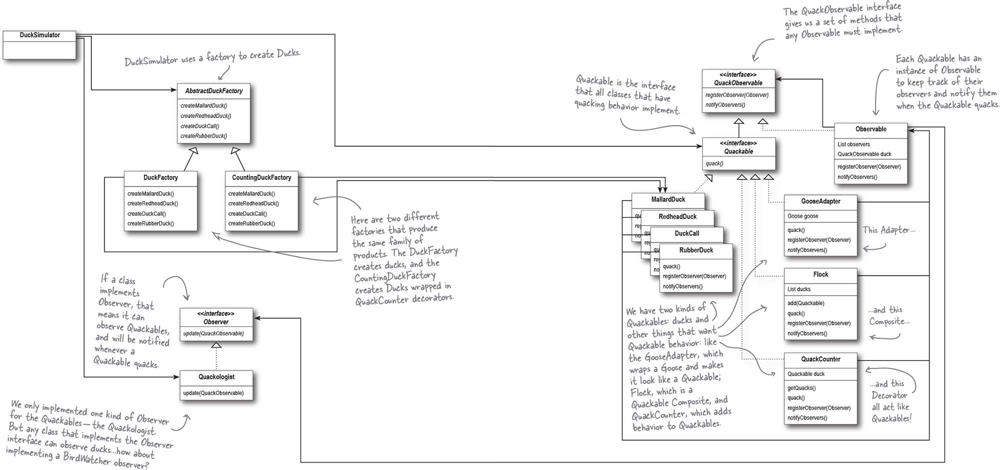
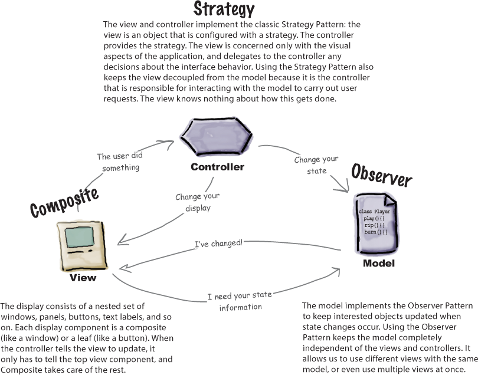

# Chapter 12. Patterns of Patterns: Compound Patterns

There's a special name for a set of patterns that work together in a design that can be applied over many problems: _a compound pattern_.

One example of a compound pattern is Model-View-Controller, otherwise known as MVC.

Patterns are often used together and combined within the same design solution. A compound pattern combines two or more patterns into a solution that solves a recurring or general problem.

## Revisiting Duck Simulator

We can rebuild our duck simulator and give it some intersting capabilities by using a bunch of patterns.

1. First, create a Quackable interface

```java
public interface Quackable {
  public void quack();
}

```

2. Then, we create some concrete duck classes that implement `Quackable`.

```java

public class MallardDuck implements Quackable {
  public void quack() {
    System.out.println("Quack");
  }
}

public class RedheadDuck implements Quackable {
  public void quack() {
    System.out.println("Quack");
  }
}

public class DuckCall implements Quackable {
  public void quack() {
    System.out.println("Kwak");
  }
}

public class RubberDuck implements Quackable {
  public void quack() {
    System.out.println("Squeak");
  }
}

```

3. Now that we have our duck classes, we can create the duck simulator.

```java
public class DuckSimulator {
  public static ovid main(String[] args) {
    DuckSimulator simulator = new DuckSimulator();
    simulator.simulate();
  }

  void simulate() {
    Quackable mallardDuck = new MallardDuck();
    Quackable redheadDuck = new RedheadDuck();
    Quackable duckCall = new DuckCall();
    Quackable rubberDuck = new RubberDuck();

    System.out.println("\nDuck Simulator");

    simulate(mallardDuck);
    simulate(redHeadDuck);
    simulate(duckCall);
    simulate(rubberDuck);
  }

  void simulate(Quackable duck) {
    duck.quack();
  }
}

```

4. Let's say there's a goose that has been hanging around the simulator as well.

```java

public class Goose {
  public void honk() {
    System.out.println("Honk");
  }
}

```

_Brain Power Question_
If we wanted to be able to use a Goose anywhere we'd want to use a Duck, what pattern would allow Geese to easily intermingle with Ducks?

- Adapater pattern: we could adapt the geese to the Quackable interface

5. Add a goose adapter (yay I got it right!). Since our simulator expects Quackable interfaces, we can use adapter pattenr to adapt a goose to a duck.

```java
public class GooseAdapater implements Quackable {
  Goose goose;

  public GooseAdapter(Goose goose) {
    this.goose = goose;
  }

  public void quack() {
    goose.honk();
  }
}

```

6. Now geese can play in the simulator too, as long as we wrap it in this adapter!

```java
public class DuckSimulator {
  public static ovid main(String[] args) {
    DuckSimulator simulator = new DuckSimulator();
    simulator.simulate();
  }

  void simulate() {
    Quackable mallardDuck = new MallardDuck();
    Quackable redheadDuck = new RedheadDuck();
    Quackable duckCall = new DuckCall();
    Quackable rubberDuck = new RubberDuck();
    Quackable gooseDuck = new GooseAdapter(new Goose());

    System.out.println("\nDuck Simulator");

    simulate(mallardDuck);
    simulate(redHeadDuck);
    simulate(duckCall);
    simulate(rubberDuck);
    // the goose is wrapped, we can treat it like every other object
    simulate(gooseDuck);
  }

  void simulate(Quackable duck) {
    duck.quack();
  }
```

7. Running the simulator with the goose included, we see that it works as expected!

_Quackology_: One thing Quackologists have always wanted to study is the total number of quacks made by a flock of ducks. How can we add the ability to count duck quacks without having to change the duck classes?

- Observer pattern: we could get notified every time a duck quacks and set a counter that incrememnts based off these notifications.
- Decorator pattern: we can attach a counter to the ducks

8. To give the Quackologists the quack counts, we'll implement a decorator!

```java
/**
 *  QuackCounter is a decorator that helps us keep track of
 *  the count of quacks.
 */
public class QuackCounter implements Quackable {
  // This instance variable holds on to the quacker we're decorating
  Quackable duck;

  // We use a static var because we're keeping count of the total quacks
  static int numberOfQuacks;

  public QuackCounter(Quackable duck) {
    this.duck = duck;
  }

  public void quack() {
    // When quack() is called, we delegate the call to the Quackable
    // we're decorating
    duck.quack();
    numberOfQuacks++;
  }

  public static int getQuacks() {
    return numberOfQuacks;
  }
}

```

9. Now, time to update the simulator with the decorated ducks.

```java
public class DuckSimulator {
  public static void main(String[] args) {
    DuckSimulator simulator = new DuckSimulator();
    simulator.simulate();
  }

  void simulate() {
    Quackable mallardDuck = new QuackCounter(new MallardDuck());
    Quackable redheadDuck = new QuackCounter(new RedheadDuck());
    Quackable duckCall = new QuackCounter(new DuckCall());
    Quackable rubberDuck = new QuackCounter(new RubberDuck());
    Quackable gooseDuck = new GooseAdapter(new Goose());

    System.out.println("\nDuck Simulator with Simulator");

    simulate(mallardDuck);
    simulate(redHeadDuck);
    simulate(duckCall);
    simulate(rubberDuck);
    // the goose is wrapped, we can treat it like every other object
    simulate(gooseDuck);

    System.out.println("The ducks quacked " + QuackCounter.getQuacks() + " times");
  }

  void simulate(Quackable duck) {
    duck.quack();
  }
}
```

In order to get the decorated behavior, we have to decorate the objects by wrapping them. If we wanted to take the duck creation and decorating behavior, and encapsulate it, what pattern could we use?

- Factory pattern

10. We need a factory to produce ducks!
    We're going to build a factory to product the ducks, this also allows us to have some quality control. (also yay, I got the right answer again!!)

The factory should produce a family of products that consists of different types of ducks, so we're going to use the Abstract Factory Pattern.

```java
public abstract class AbstractDuckFactory {
  public abstract Quackable createMallardDuck();
  public abstract Quackable createRedheadDuck();
  public abstract Quackable createDuckCall();
  public abstract Quackable createRubberDuck();
}
```

```java
public Quackable extends AbstractDuckFactory {
  public Quackable createMallardDuck() {
    return new MallardDuck();
  }

  public Quackable createRedheadDuck() {
    return new RedheadDuck();
  }

  public Quackable createDuckCall() {
    return new DuckCall();
  }

  public Quackable createRubberDuck() {
    return new RubberDuck();
  }
}
```

Now, to create the factory we really want.. the `CountingDuckFactory`

```java
public class CountingDuckFactory extends AbstractDuckFactory {
  public Quackable createMallardDuck() {
    return new QuackCounter(new MallardDuck());
  }

  public Quackable createRedheadDuck() {
    return new QuackCounter(new RedheadDuck());
  }

  public Quackable createDuckCall() {
    return new QuackCounter(new DuckCall());
  }

  public Quackable createRubberDuck() {
    return new QuackCounter(new RubberDuck());
  }
}

```

11. Now, let's set up the simulator to use the factory.
    To do this, we create a polymorphic method that takes a factory and uses it to create objects. By passing in different factories, we get to use different product families in the method. We're going to alter the simulate() method so that it takes a factory and uses it to create ducks.

```java
public class DuckSimulator {
  public static void main(String[] args) {
    DuckSimulator simulator = new DuckSimulator();
    AbstractDuckFactory duckFactory = new CountingDuckFactory();

    simulator.simulate(duckFactory);
  }

  void simulate(AbstractDuckFactory duckFactory) {
    Quackable mallardDuck = duckFactory.createMallardDuck();
    Quackable redheadDuck = duckFactory.createRedheadDuck();
    Quackable duckCall = duckFactory.createDuckCall();
    Quackable rubberDuck = duckFactory.createRubberDuck();
    Quackable gooseDuck = new GooseAdapter(new Goose());

    System.out.println("\nDuck Simulator with Simulator");

    simulate(mallardDuck);
    simulate(redHeadDuck);
    simulate(duckCall);
    simulate(rubberDuck);
    // the goose is wrapped, we can treat it like every other object
    simulate(gooseDuck);

    System.out.println("The ducks quacked " + QuackCounter.getQuacks() + " times");
  }

  void simulate(Quackable duck) {
    duck.quack();
  }
}
```

We're still directly instantiating Geese by relying on concrete classes. Can you write an Abstract Factory for Geese? How should it handle creating "goose ducks"?

Another quesiton: why are we managing ducks individually? It would be nice if we could apply operations across the wholse set of ducks. What pattern can help us?

12. Let's create a flock of ducks (Quackables) using the Composite Pattern!
    Remember: the Composite pattern allows us to treat a collection of objects in the same way as individual objects.

```java
public class Flock implements Quackable {
  // We're using an ArrayList to hold the Quackables that belong to each flock
  List<Quackable> quackers = new ArrayList<Quackable>();

  /**
   * This method serves to add quackable to the flock
   */
  public void add(Quackable quacker) {
    quackers.add(quacker);
  }

  /**
   * This method serves to get a quack from each member of the flock
   */
  public void quack() {
    Iterator<Quackable> iterator = quackers.iterator();

    // It's the iterator pattern!!
    while (iterator.hasNext()) {
      Quackable quacker = iterator.next();
      quacker.quack();
    }
  }
}
```

13. Now, we need to alter the simulator with the composite structure.

```java
public class DuckSimulator {
 public static void main(String[] args) {
    DuckSimulator simulator = new DuckSimulator();
    AbstractDuckFactory duckFactory = new CountingDuckFactory();

    simulator.simulate(duckFactory);
  }

  void simulate(AbstractDuckFactory duckFactory) {
    Quackable redheadDuck = duckFactory.createRedheadDuck();
    Quackable duckCall = duckFactory.createDuckCall();
    Quackable rubberDuck = duckFactory.createRubberDuck();

    System.out.println("\nDuck Simulator with Simulator");

    Flock flockOfDucks = new Flock();

    Quackable mallardOne = duckFactory.createMallardDuck();
    Quackable mallardTwo = duckFactory.createMallardDuck();
    Quackable mallardThree = duckFactory.createMallardDuck();

    Flock flockOfMallards = new Flock();

    flockOfMallads.add(mallardOne);
    flockOfMallads.add(mallardTwo);
    flockOfMallads.add(mallardThree);

    flockOfDucks.add(flockOfMallards);

    System.out.println("\nDuck Simulator: Whole Flock Simulation");
    simulate(flockOfDucks);

    System.out.println("\nDuck Simulator: Mallard Flock Simulation");
    simulate(flockOfMallards);

    System.out.println("The ducks quacked " + QuackCounter.getQuacks() + " times");
  }

  void simulate(Quackable duck) {
    duck.quack();
  }

}

```

A quick note about the composite pattern:

- In the previous chapter about the Composite Pattern, the composites (Menus) and the leaves (MenuItems) had the exact same set of methods, including add() method. Because of this, we could call methods on MenuItems that didn't really make sense (like trying to add something to a MenuItem by calling add()). The benefit of this was that the distinction between leaves and composite was _transparent_. The client didn't have to know whether it was dealing with a leaf or composite; it just called the same methods on both.
- In this case, we're keeping the composite's child maintenance methods separate from leaf nodes (only FLocks have the add() method). It doesn't make sense to try to add something to a Duck in this implementation, so this design is _safer_, but it's less _transparent._

Now, they're asking if we can provide a way to keep track of individual duck quacking in real time.

- Enter the Oberver pattern!

14. The Quackologist would like to observe individual duck behavior. We can implement this functionality by using the Observer Pattern.
    An Observable needs methods for registering and notifying observers.

```java
public interface QuackObservable {
  public void registerObserver(Observer observer);
  public void notifyObservers();
}
```

Now, we need to make sure all Quackables implement this interface.

```java
public interface Quackable extends QuackableObservable {
  public void quack();
}
```

15. Then, we need to make sure all concrete classes that implement Quackable can handle being a QuackObservable. We will do this by encapsulating the registration and notification code in another class, call it an Observable, and compose it with QuackObservable.

```java
public class Observable implements QuackObservable {
  List<Observer> observers = new ArrayList<Observer>();
  QuackObservable duck;

  public Observable(QuackObservable duck) {
    this.duck = duck;
  }

  public void registerObserver(Observer observer) {
    observers.add(observer);
  }

  public void notifyObservers() {
    Iterator iterator = observers.iterator();
    while (iterator.hasNext()) {
      Observer observer = iterator.next();
      observer.update(duck);
    }
  }
}

```

16. Integrate the helper Observable with the Quackable classes.

We need to make sure the Quackable classes are composed with an Observable and that they know how to delegate to it.

```java
public class MallardDuck implements Quackable {
  // Each Quackable has an Observable instance variable
  Observable observable;

  public MallardDuck() {
    observable = new Observable(this);
  }

  public void quack() {
    System.out.println("Quack");

    // When we quack, we let the observers know about it
    notifyObservers();
  }

  // These two methods below are the two QuackObservable methods.
  // We just delegate the call to the helper
  public void registerObserver(Observer observer) {
    observable.registerObserver(observer);
  }

  public void notifyObservers() {
    observable.notifyObservers();
  }
}
```

We also need to update the QuackCounter decorator to make it an Observable.

```java
public class QuackCounter implements Quackable {
  Quackable duck;
  // We use a static var because we're keeping count of the total quacks
  static int numberOfQuacks;

  public QuackCounter(Quackable duck) {
    this.duck = duck;
  }

  public void quack() {
    // When quack() is called, we delegate the call to the Quackable
    // we're decorating
    duck.quack();
    numberOfQuacks++;
  }

  public static int getQuacks() {
    return numberOfQuacks;
  }

  public void registerObserver(Observer observer) {
    duck.registerObserver(observer);
  }

  public void notifyObservers() {
    duck.notifyObservers();
  }
}

```

17. Now, we need to work on the Observer side fo the pattern.

```java
public interface Observer {
  public void update(QuackObservable duck);
}

```

```java
public class Quackologist implements Observer {
  public void update(QuackObservable duck) {
    System.out.println("Quackologist: " + duck + " just quacked.");
  }
}
```

18. Time to update the simulator with the observer!

```java
public class DuckSimulator {
 public static void main(String[] args) {
    DuckSimulator simulator = new DuckSimulator();
    AbstractDuckFactory duckFactory = new CountingDuckFactory();

    simulator.simulate(duckFactory);
  }

  void simulate(AbstractDuckFactory duckFactory) {
    Quackable redheadDuck = duckFactory.createRedheadDuck();
    Quackable duckCall = duckFactory.createDuckCall();
    Quackable rubberDuck = duckFactory.createRubberDuck();

    System.out.println("\nDuck Simulator with Simulator");

    Flock flockOfDucks = new Flock();

    Quackable mallardOne = duckFactory.createMallardDuck();
    Quackable mallardTwo = duckFactory.createMallardDuck();
    Quackable mallardThree = duckFactory.createMallardDuck();

    Flock flockOfMallards = new Flock();

    flockOfMallads.add(mallardOne);
    flockOfMallads.add(mallardTwo);
    flockOfMallads.add(mallardThree);

    flockOfDucks.add(flockOfMallards);

    System.out.println("\nDuck Simulator: With Observer");
    Quackologist quackologist = new Quackologist();
    flockOfDucks.registerObserver(quackologist);

    simulate(flockOfDucks);

    System.out.println("The ducks quacked " + QuackCounter.getQuacks() + " times");
  }

  void simulate(Quackable duck) {
    duck.quack();
  }
```

## Summary of refactoring Duck Simulator with all the patterns!



- **Adapater Pattern**: used to adapat the goose to a Quackable.
- **Decorator Pattern**: used to add a QuackCounter decorator to keep track of the number of times quack() is called.
- **Abstract Factory Pattern**: used to encapsulate the creation of decorated ducks.
- **Composite Pattern**: used to help manage keeping track of the ducks, geese, and quackables by allowing us to create flocks to manage duck families.
- **Observer Pattern**: ued to allow Quackologists to be notified every time a Quackable quacks.

## Model View Controller

- **Model**: the model holds all the data, state, and application logic. The model is oblivious to the view and controller, although it provides an interfaces to manipulate and retrieve its state and it can send notifications of state changes to observers.
- **View**: Gives you the presentation of the model. The view usually gets the state and data it needs to display directly from the model.
- **Controller**: Takes user input and figures out what it means to the model.

### Understanding MVC as a set of Patterns

The model uses Observer to keep the views and controllers updated on the latest state changes.

The view and the controller, on the other hand, implement the Strategy Pattern. The controller is the strategy of the view, and it can easily be exchanged with another controller if you want different behavior.

The view itself uses the Composite Pattern internally to manage the windows, buttons, and other components of the display.


